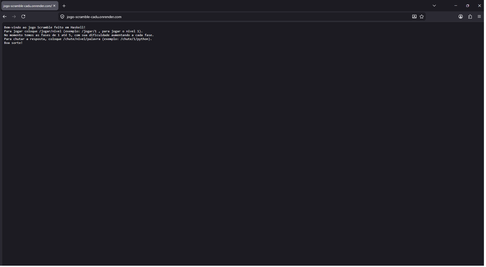

# Backend Web com Haskell+Scotty

- Estrutura e conteúdo do README:

  3. Processo de desenvolvimento: comentários pessoais sobre o desenvolvimento, com evidências de compreensão, incluindo versões com erros e tentativas de solução
  4. Orientações para execução: instalação de dependências, etc.
  5. Resultado final: demonstrar execução em GIF animado ou vídeo curto (máximo 60s)
  6. Referências e créditos (incluindo alguns prompts, se aplicável)

## 1. Identificação

- Nome: Carlos Eduardo Silva de Oliveira
- Curso: Sistemas de Informação

---

## 2. Tema/objetivo

O tema do trabalho foi fazer o jogo Scramble (Usuario recebe uma palavra embaralhada e deve dizer qual a palavra desembaralhada).
O objetivo principal não era o jogo e sim utilizar o Haskell e o Scotty para implementar o backend e as funções lógicas por trás do jogo.
A lógica principal do trabalho foi utilizar as funções puras da programação funcional, como a manipulação de listas de tuplas e filtragem de dados.
Foram utilizados conhecimentos que aprendi durante as aulas mais evidentemente List Comprehensions, Pattern Matching e funções de ordem superior como map.

---

## 3. Processo de desenvolvimento

A ideia inicial do jogo eu ja tinha em mente quando comecei, a primeira etapa do desenvolvimento foi lidar apenas com as funções mais importantes e basicas para a lógica do jogo, ignorei completamente a parte da Main com Scotty para implementar apenas a lógica em Haskell pura.
O inicio comecei com 3 exemplos basicos, fiz o jogo o mais simples possível pois era apenas pra testes, a ideia que eu tive para começar foi utilizar listas de tuplas para guardar os dados do jogo na sequencia de (Nivel, Palavra Embaralhada, Palavra correta) para ser facil de manipular os dados, pois tudo estava dentro de uma tupla correspondente. Com as listas inseridas segui para a lógica da separação dos dados das listas para criar funções que retornem ao usuario o que ele pediu. Exemplo disso é na função buscarDesafio, onde prevalecem o que estudamos em aula, como o isolamento de dados utilizando '_' e fazendo as comparações. Depois da lógica ter sido implementada em sua forma simples, eu quis seguir para o caminho onde iria testar se eu conseguiria conectar essa logica com o Scotty. Eu fiz os testes antes disso mas isso é pra proxima parte, entao falarei do Scotty. No desenvolvimento com Scotty foi onde surgiram a maior parte dos meus problemas. A parte com Haskell foi até tranquila pois ja tinha estudado bem e feito exercicios em aula, mas implementar com Scotty foi algo totalmente novo. Eu tive que utilizar bastante IA para conseguir chegar em um resultado que eu estava procurando, pois tinham muitas coisas que eu nunca tinha visto na minha vida como Dockerfiles, arquivos pro render, então essa parte foi a maior parte da curva de aprendizado pra mim. A parte lógica da Main foi legal de fazer, cada vez que eu adicionava novas páginas pro jogo, mais coisas eu lembrava que estavam faltando ou que eu gostaria que tivesse. Eu nao consegui de jeito nenhum fazer funcionar no meu computador pra hostear no localhost. Essa foi a parte onde passei mais tempo do meu projeto, tentei com outras rotas (8080), tentei em outros endereços, desativei firewall, mudei código, mudei nomes de arquivos e mesmo assim a página não carregava. A IA me ajudou muito nessa parte, mas mesmo com ajuda dela, não resolvi isso, então segui algo que a IA me recomendou, colocar tudo no Render e testar por lá, porque o problema era provavelmente alguma coisa no meu ambiente do PC. Então com a versão mais simples do jogo eu lancei no Render. Lá funcionou e eu consegui testar meu jogo, o que foi muito bom, pois ao testar o jogo fui lembrando de coisas que faltavam, então fui adicionando aos poucos. Mais ao final coloquei fases com dificuldade que ia aumentando, adicionei mais fases, coloquei um sistemas de dicas na Main, onde o usuario pode usar o url pra pegar uma dica da fase em que está e por fim lembrei de algo muito importante pro jogo que era aceitar letras minusculas ou maiusculas como resposta, exemplo para entendimento: se a resposta de uma fase era "teste" e a pessoa colocasse "Teste", o resultado diria que ela errou. Utilizei uma função importada toLower e dei map para colocar na string porque essa função é para char. A versão final do jogo ficou com 5 fases, dicas e dificuldade que aumenta a cada fase e um sistema que corrige o input do usuario. Sei que não estava como obrigatório, mas eu gostaria de ter feito uma página mais bonita com um front-end legal, mas essa foi a primeira vez na vida que mexi com programação fora do terminal e coisas básicas, então ficaria muito complicado pra mim e acho que viraria apenas algo a mais para eu me preocupar.

## 4. Testes

Para realizar os testes das funções puras com a lógica do jogo fiz uma série de testes em um Testes.hs onde cada função é testada e retorna para o terminal o resultado esperado (PASSOU ou FALHOU). Para cada teste foram feitas a chamada das funções e comparações dos resultados com o que é esperado, se der diferente do resultado que está definido ele retorna FALHOU ou se estiver certo retorna PASSOU. Os testes testam para inputs invalidos, incorretos, corretos e o tratamento de upper e lowercase. Não foi utilizado HUnit, apenas comparações simples com resultados esperados e retornos para o terminal.

---

## 5. Execução

Para executar o trabalho vá até o diretorio da pasta src, se quiser rodar o código de Testes, de runhaskell Testes.hs, para testar as funções uma a uma de ghci LogicaScramble.hs e digite manualmente os valores que você gostaria de testar. Para executar o main completo dê runhaskell Main.hs, ele deverá abrir a porta 3000 para voce acessar no seu navegador com o localhost. A pagina inicial https:localhost:3000/ deve mandar a mensagem de bem-vindo e dar as instruções necessárias para jogar. No meu computador nao consegui rodar pelo localhost, tive que fazer os testes diretamente com o deploy do Render, então nao sei se estará 100% funcional no localhost (provavelmente estará pois o arquivo funciona complemente no Render).

## 6. Deploy

Link do serviço publicado: https://jogo-scramble-cadu.onrender.com/

Para fazer o deploy, após fazer a Main, precisei fazer os arquivos Dockerfile e render.yaml, como nunca mexi com esses arquivos precisei de ajuda da IA para saber como completar o que faltava na pasta pra conseguir dar o deploy. Coloquei no Dockerfile as dependencias necessárias, que são basicamente as mesmas da demo-scotty que tinha no github da disciplina, talvez tenha até coisas que não são necessarias pra esse projeto, mas o jogo funciona então nao mexi no que estava funcionando. Marquei como a porta 3000 que é o que está na main e é o default do Render. 
Depois desses ajustes em alguns arquivos, dei os commits pra main e fui pro site do Render, la criei um novo Blueprint, conectei com a conta do GitHub que reconheceu o projeto no github e dei Deploy no meu jogo. A partir dai funcionou e consegui arrumar coisas que faltavam no jogo. 

## 7. Resultado final

## 8. Uso de IA 

### 8.1 Ferramentas de IA utilizadas

A principal IA utilizada foi o Gemini 3.1, versão Rápida e a versão Pro. Utilizei o ChatGPT, mas foi pra tentar resolver um bug que o Gemini não conseguiu mas ele também não conseguiu.

### 8.2 Interações relevantes com IA

#### Interação 1

- **Objetivo da consulta: Arrumar erro que eu não estava encontrando no meu código**  
- **Trecho do prompt ou resumo fiel: Functionsv1.hs:13:1: error: [GHC-58481]

    parse error (possibly incorrect indentation or mismatched brackets)

   |

13 | ]

   | ^

Failed, no modules loaded. **  

**Enviei o trecho que veio do terminal**
- **O que foi aproveitado:Era um erro bem bobo de formatação, olhando bem eu poderia ter resolvido sozinho, mas na hora eu nao conseguia encontrar olhando pro código.**  
- **O que foi modificado ou descartado:A formatação apenas trouxe a ']' mais pra esquerda e o código rodou.**  

#### Interação 2

- **Objetivo da consulta:Eu estava com um erro, onde a linha do "import LogicaScramble" estava sublinhada como se tivesse um erro**  
- **Trecho do prompt ou resumo fiel: Eu fiz as mudanças exatamente como pedido, o LogicaScramble está sem nenhuma linha vermelha, funcionando corretamente, mas as outras .hs nao reconhecem o LogicaScramble, isso nao faz sentido. A LogicaScramble.hs está na mesma pasta (src) certinho (também foram enviadas imagens do meu VSCode pro Gemini)**  
- **O que foi aproveitado: O Gemini conseguiu reconhecer que meu código não tinha erros e na verdade era apenas um bug visual do VSCode, e se eu rodasse o código ele funcionaria corretamente. Isso salvou bastante tempo e frustração.**  
- **O que foi modificado ou descartado:Eu fiz várias alterações tentando arrumar o "erro", nada funcionou então voltei pro meu ultimo ponto salvo (ultimo commit que tinha feito) e segui em frente com o projeto, o que deu certo e o erro sumiu do nada depois.**  

#### Interação 3 

- **Objetivo da consulta: Compreender novos tipos de arquivos**  
- **Trecho do prompt ou resumo fiel: Tenho esses arquivos Dockerfile e render.yaml. É a primeira vez que lido com este tipo de arquivos, quais mudanças preciso fazer nos arquivos para conseguir dar deploy no Render? (enviei os arquivos do demo)**  
- **O que foi aproveitado:Descobri o que eram os dados dentro dos arquivos e quais as mudanças eu precisava fazer para adaptalos ao meu projeto.**  
- **O que foi modificado ou descartado:Foram mudadados os diretorios do Dockerfile, o nome do arquivo de execução do servidos e outras mudanças necessarias pro deploy. O render.yaml tem o autoDeployTrigger que toda vez que eu mando commits, ele altera o deploy do Render, deixando o jogo sempre atualizado com meus commits.**  

### 8.3 Exemplo de erro, limitação ou sugestão inadequada da IA

O principal erro que encontrei durante minha progressão no trabalho, foi pra tentar rodar o Main.hs no meu localhost. Foram mais de 10 prompts pedindo ajuda e analisando código, mexendo no computador e nada de resolver. Mandei mensagens do meu terminal pro Gemini e pro ChatGPT perguntando porque minha Main.hs dizia que estava funcionando o localhost, mas quando eu entrava no site, nao carregava. O Gemini mandou eu alterar as portas de 3000 para 8080, mandou eu desligar firewall do windows, mandou eu reinstalar dependencias, mandou eu tentar com ip direto inves do localhost, mandou eu rodar no terminal com o ghc -threaded que gerou o Main.exe, ABSOLUTAMENTE nada disso fez o site funcionar localmente, e por incrivel que pareça, nao era nenhum erro no código, pois o mesmo código estava 100% correto de acordo com as IAs, o que fez eu recorrer a ir direto pro deploy no Render.

### 8.4 Comentário pessoal sobre o processo envolvendo IA

A IA me salvou muito nesse projeto, sem ela eu teria perdido muito tempo em coisas que pareciam estar erradas mas na verdade estavam corretas, como exemplo o que citei antes: Main.hs nao rodar localmente, linhas sublinhadas vermelhas onde não haviam erros. Ela me ajudou também com coisas mais básicas que eu ja deveria saber como erro em espaçamentos, erros por coisas bobas como falta de fechar um parentêse. Foram raros momentos em que ela me atrapalhou, mas houveram momentos como quando perguntei como resolvia algo na identação e ela me deu um resposta que não era correta, falando que era da versão especifica do Haskell que eu estava utilizando, esse tipo de coisa as vezes gera mais dúvidas na hora de programar.

## 9. Referências e créditos

- Principal ajuda: https://gemini.google.com
- Lógicas e funções puras : https://github.com/AndreaInfUFSM/elc117-2026a
- Material com descrições e exemplos: http://www.zvon.org/ (parte de haskell)
- Colegas me ajudaram a resolver problemas na hora de baixar depencias.
- Documentação do Scotty: https://hackage.haskell.org/package/scotty